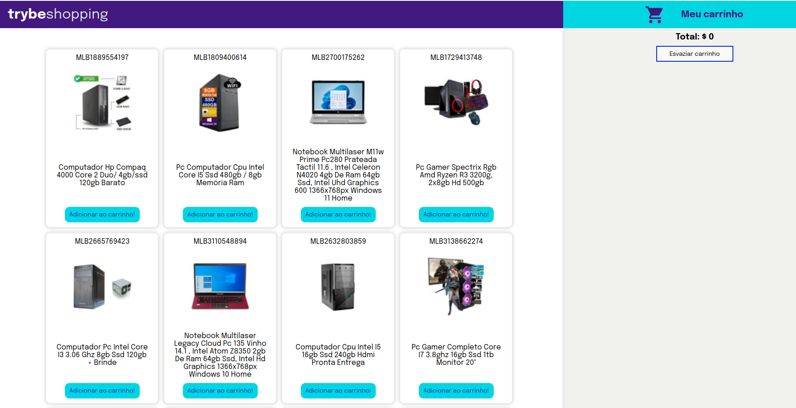

Projeto carrinho de compras

Usando dados diretamente de uma API! 

Uma API é um ponto de contato na internet com determinado serviço e nesse projeto usei a API do Mercado Livre para buscar produtos à venda.

Nesse projeto também tive a experiência de pôr em prática o desenvolvimento orientado a testes, o famoso TDD (Test Driven Development)! 

Screenshot

